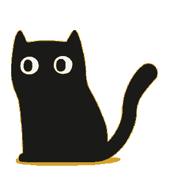

# Пятый учебный проект от Яндекс.Практикум
## Soda
Натуральные лимонады
### Ссылка на проект
<https://grbchk.github.io/soda/>
### Используемые технологии

**HTML5**

**SCSS**

**CSS3**

#### Особенности проекта и применяемые CSS свойства:

> Основывалась на подходе desktop-first

**БЭМ nested**

>Организация файловой структуры выполнена вручную.
>
>SCSS скомпилирован в CSS расширением VS Code - Live Sass Compiler v5.1.0

**Grid Layout**

>Представляет из себя двумерную систему компоновки основанную на сетке, которую можно использовать для размещения областей страницы или небольших элементов пользовательского интерфейса. Поддерживается [большинством браузеров](https://caniuse.com/?search=grid).

**Flexbox Layout**

>Предоставляет эффективный способ расположения, выравнивания и распределения свободного пространства между элементами, даже когда их размер и порядок заранее неизвестен и/или динамичен. Используется для разметки страницы. Имеет [широкую поддержку](https://caniuse.com/?search=flex) браузерами.

**Медиазапросы**

>(Media queries)
>
>Медиавыражения позволяют адаптировать страницу для различных типов устройств, разрешений экранов и т.д.

**Адаптивная и резиновая верстка**

>(Elastic layout & Adaptive Layout)
>
>Подразумевают возможность компонентов сайта менять свои размеры, растягиваться, подстраиваться под разрешение экрана, менять размер шрифта, расположение объектов, цвет и т. д. Происходит это динамически, например, с использованием медиазапросов (@media). Таким образом сайт изменяет свой внешний вид в зависимости от типа устройства.
>
>Пять основных интервалов разрешений:
>
>>от 1280 до бесконечности — разрешение стандартных ноутбуков, телевизоров и прочих широкоэкранных устройств;
>>
>>от 1024 до 1280 — небольшие ноутбуки;
>>
>>от 768 до 1024  — от вертикального до горизонтального положения планшета;
>>
>>от 425 до 768 — от большого смартфона до вертикального положения планшета;
>>
>>до 425 — мобильные устройства.
>
**Заключение**

Реализуя данный проект мне удалось освоить и закрепить ценные для каждого разработчика знания.

Спасибо за просмотр!
